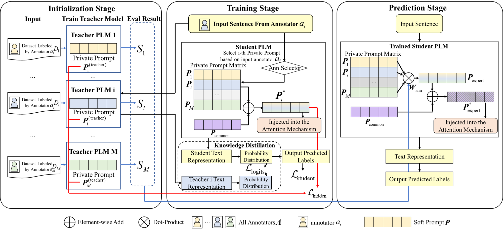

# Personalized Soft Prompt Tuning in Pre-trained Language Models: Bridging Multitask Transfer Learning and Crowdsourcing Learning

Welcome to the official repository for our paper **"Personalized Soft Prompt Tuning in Pre-trained Language Models: Bridging Multitask Transfer Learning and Crowdsourcing Learning."**



## Overview
This repository contains the source code used in our work. We have **uploaded the initial version of the code**; it will continue to evolve as we refine our approach and incorporate new features. If you have any questions, please feel free to contact us.

## Paper and Citation
If you use our approach in your research, please cite our work using the following BibTeX entry:

```bibtex
@article{tian2024personalised,
  title={Personalised soft prompt tuning in pre-trained language models: Bridging multitask transfer learning and crowdsourcing learning},
  author={Tian, Zeshu and Zhang, Hongli and Wang, Yan},
  journal={Knowledge-Based Systems},
  volume={305},
  pages={112646},
  year={2024},
  publisher={Elsevier}
}
